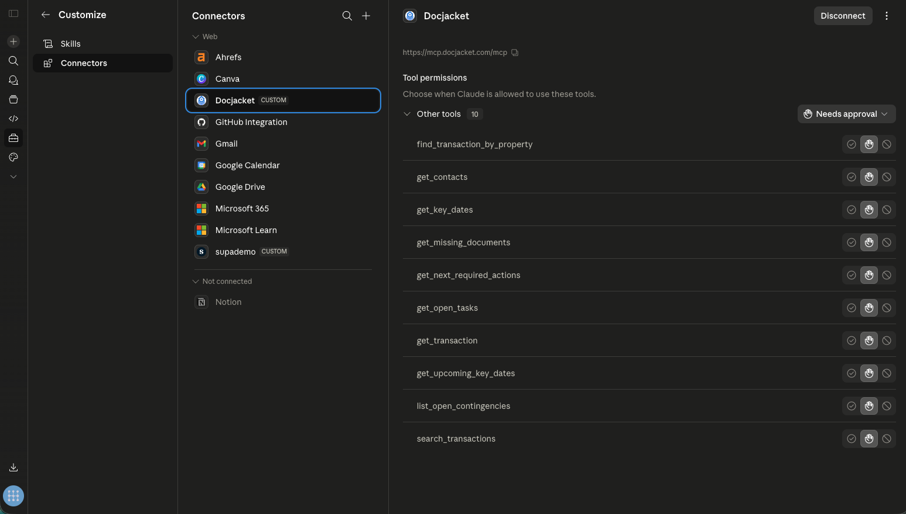

<p align="left">
  
</p>

# DocJacket — Transaction Coordination plugin for Claude

[](https://claude.com/plugins)
[]()
[]()

Connect DocJacket transactions, tasks, deadlines, contacts, and document checklists to Claude. Triage your pipeline, draft and send follow-up emails from your connected Gmail/Outlook, classify inbound attachments against the right deal — all from inside Claude.

**Works with:** Claude.ai (sidebar) · Cowork · Claude Code · Claude Desktop



## What you get

- **Full read + send tool suite** via the DocJacket MCP server at `https://mcp.docjacket.com/mcp`. Call `mcp_catalog` after install for the live inventory + per-tool gotchas and example calls.
- **`mcp_health_check`** — first call when integrating; verifies auth, scopes, and DB reachability before you start a workflow.
- **8 skills** ship with this plugin: `daily-triage`, `email-triage`, `closing-prep`, `follow-up-drafting`, `document-filing`, `contact-management`, `execution-workflow`, `tc-context`. The agent picks them automatically based on what you ask.
- **9 slash commands** (Cowork + Claude Code): `/docjacket:morning-briefing`, `/docjacket:whats-next`, `/docjacket:email-triage`, `/docjacket:doc-check`, `/docjacket:weekly-report`, `/docjacket:share-portal`, `/docjacket:intake-contract`, `/docjacket:send-template`, `/docjacket:check-submissions`. See [Slash Commands reference](https://help.docjacket.com/docs/mcp/slash-commands) for what each one does.
- **Status Reporter** sub-agent (Cowork) — read-only weekly briefing across every active deal.

Three scope tiers — Read (search, summarize), Draft (compose without sending), Actions (send emails, create tasks, update dates). You authorize once at OAuth consent; the chat is the per-call approval gate.

## Tool catalog

Selected highlights below. For the **live and complete** list with per-tool gotchas, pairing hints, and example calls, run `mcp_catalog` after install — the server returns its own enumeration so this README never drifts.

| Tool | Purpose |
|---|---|
| `mcp_health_check` | Verify auth, scopes, and DB reachability. Run this first when integrating. |
| `mcp_catalog` | Enriched list of every tool you can call — gotchas, pairings, examples. |
| `search_transactions` | Search by address, party name, MLS, status |
| `get_transaction` | Full state of one deal including joined key dates + parties |
| `get_key_dates` | Key Dates for one transaction |
| `get_upcoming_key_dates` | Org-wide upcoming deadlines, default 14-day horizon |
| `get_next_required_actions` | **Bundled judgment** — overdue + upcoming, pre-ranked with rationales |
| `get_missing_documents` | Universal-baseline missing-doc detection for purchase deals |
| `find_transaction_by_property` | Fuzzy address-to-deal matching with confidence scores |
| `list_active_transactions` | Inbox-workflow shortcut — every active deal, optional party / key-date expansion |
| `search_contacts` / `get_contact` | Contact lookup by name/email/phone/company |
| `list_email_templates` / `get_email_template` / `render_email_template` | Templated email composition |
| `send_client_update` / `send_agent_followup` / `send_document_request` / `send_email_to_agent` | Direct execution from your connected Gmail/Outlook |
| `create_tasks` / `update_key_date` / `complete_task` / `save_status_summary` | Direct execution against DocJacket |

## Install

**No bearer tokens. No manual config.** Paste the server URL, click Allow on the consent screen, you're done. OAuth 2.1 + Dynamic Client Registration end-to-end.

### Prerequisites

A DocJacket account on the **Pro plan**. Connecting is free; loading tools requires Pro.

### Claude.ai (web sidebar)

1. **Settings** → **Connectors** → **+ Add custom connector**
2. Paste: `https://mcp.docjacket.com/mcp`
3. Click **Continue**, then **Allow** on the DocJacket consent screen

The tool list loads. Run `mcp_health_check` once to confirm scopes; then `mcp_catalog` for the full inventory.

### Claude Desktop

Same flow as Claude.ai:

1. **Settings** → **Connectors** → **+ Add custom connector**
2. Paste: `https://mcp.docjacket.com/mcp`
3. Complete the OAuth consent screen

### Claude Code / Cowork (plugin)

```bash
/plugin marketplace add docjacket-inc/claude-plugin
/plugin install docjacket
```

On first tool call, your browser opens to complete OAuth consent. Access + refresh tokens are stored in your local keychain — no secrets in config files.

### Claude Desktop (manual config, advanced)

If you prefer editing `~/Library/Application Support/Claude/claude_desktop_config.json` directly:

```jsonc
{
  "mcpServers": {
    "docjacket": {
      "type": "http",
      "url": "https://mcp.docjacket.com/mcp"
    }
  }
}
```

Restart Claude Desktop. The first tool call triggers OAuth discovery via the WWW-Authenticate challenge — no `Authorization` header to set, no token to mint.

## Try it

Once installed, try:

- *"What needs my attention today?"* → fires the Daily Triage skill
- *"Find the deal at 1234 Main St"* → calls `find_transaction_by_property`
- *"What contingencies are open on the Johnson deal?"* → `list_open_contingencies`
- *"What documents are still missing on this transaction?"* → `get_missing_documents`
- `@status-reporter brief me on this week` (Cowork) → weekly briefing across active deals

## How attribution + revocation work

Every plugin call carries `X-DocJacket-Source-App: claude-desktop` + `X-DocJacket-Plugin-Version: 0.6.1`. Audit them in [Activity Log](https://app.docjacket.com/settings/ai-access/activity) — filter by source, drill into per-OAuth-client activity. Revoke any connected client from `/settings/ai-access` without affecting other AI assistants (Codex, ChatGPT, etc.).

## Optional connectors

The plugin composes with Claude's Gmail, Google Calendar, Google Drive, and Slack connectors — see [`CONNECTORS.md`](CONNECTORS.md).

## Compliance + disclaimer

This plugin does NOT provide legal advice. See [`DISCLAIMER.md`](DISCLAIMER.md) for the full scope, per-state coverage notes, and liability framing.

## Version

`0.6.1` (2026-05-20) — Adds three new slash commands: `/docjacket:whats-next` (ranked task + key-date feed), `/docjacket:send-template` (pick template → render → send via connected Gmail/Outlook), `/docjacket:check-submissions` (review new intake-form submissions). Tracks DocJacket MCP server PR #563.

`0.6.0` (2026-05-19) — Catches up to the v0.6 internal source: 8 skills (was 1), 6 commands (was 1), inbox-workflow tool set including Draft + Actions scopes. New diagnostic tools `mcp_health_check` and `mcp_catalog`. Every tool response now includes `structuredContent` + opt-in `breadcrumbs` per MCP spec 2025-06-18 §Tool Result. Tracks DocJacket MCP server PRs #549–#551.

`0.3.0` (2026-05-18) — OAuth 2.1 + Dynamic Client Registration. Paste-URL-and-go install — no bearer tokens, no manual config. Tracks DocJacket MCP server PR #494 (HTTP 401 + WWW-Authenticate + `initialize` handshake).

`0.2.0` (2026-05-18) — Daily Triage collapsed to one call (`get_next_required_actions`); 10 read tools live. Tracks DocJacket MCP server v0.9 + Plugin Cycle 3.

`0.1.0` (2026-05-17) — Initial release: 5 read tools, Daily Triage skill.

## Read more on help.docjacket.com

- **[Connect Claude](https://help.docjacket.com/docs/mcp/claude)** — install walkthrough for Claude.ai / Cowork / Claude Code / Claude Desktop
- **[Contract Intake](https://help.docjacket.com/docs/mcp/contract-intake)** — drop a PDF in chat, get a fully-set-up transaction back
- **[Slash Commands](https://help.docjacket.com/docs/mcp/slash-commands)** — full reference for the 9 `/docjacket:` commands
- **[Tool Catalog (`mcp_catalog`)](https://help.docjacket.com/docs/mcp/mcp-catalog)** — what `mcp_catalog` returns + how to read it
- **[AI Access overview](https://help.docjacket.com/docs/ai-access)** — the umbrella feature, OAuth model, scope tiers, audit

## Support

- Issues: <https://github.com/docjacket-inc/claude-plugin/issues>
- Email: support@docjacket.com

## Brand assets

| File | Size | Use |
|---|---|---|
| [`assets/logo-mark.svg`](assets/logo-mark.svg) | vector | source / scalable |
| [`assets/logo-mark-32.png`](assets/logo-mark-32.png) | 32×32 | favicon, dense list rows |
| [`assets/logo-mark-64.png`](assets/logo-mark-64.png) | 64×64 | small directory cards |
| [`assets/logo-mark-128.png`](assets/logo-mark-128.png) | 128×128 | plugin manifest icon |
| [`assets/logo-mark-256.png`](assets/logo-mark-256.png) | 256×256 | medium cards |
| [`assets/logo-mark-512.png`](assets/logo-mark-512.png) | 512×512 | marketplace tile |
| [`assets/logo-mark-1024.png`](assets/logo-mark-1024.png) | 1024×1024 | hero / future-proof |
